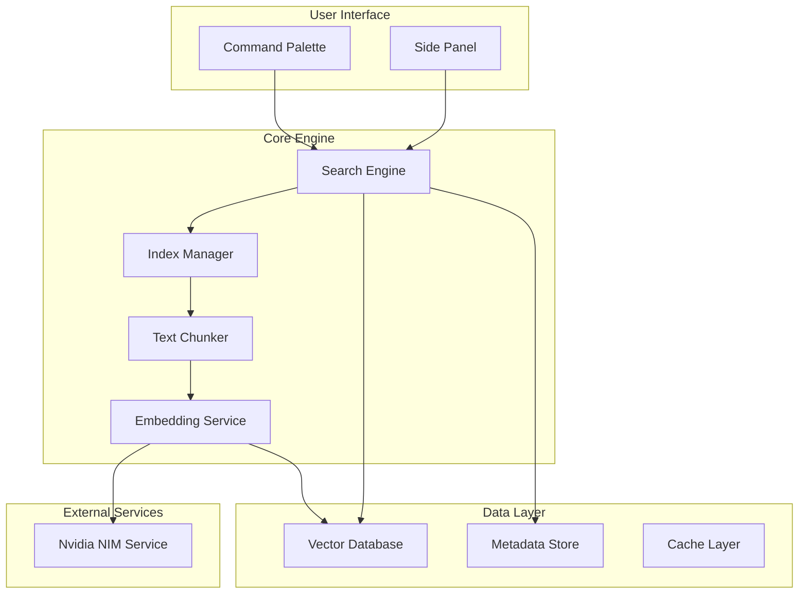

# CppSeek - Semantic Search VSCode Extension
**Product Requirements Document (PRD)**

## Executive Summary

CppSeek is a VSCode extension that revolutionizes code search by providing semantic understanding of C/C++ codebases. Instead of relying on exact text matching, developers can use natural language queries like "Where is the init logic?" to find relevant code, significantly improving development efficiency and code exploration.

## Project Overview

### Vision Statement
Transform how developers search and understand C/C++ codebases by providing AI-powered semantic search capabilities that understand code intent rather than just syntax.

### Problem Statement
- **Current Pain**: Traditional code search requires exact keyword matching, making it difficult to find relevant code without knowing specific variable/function names
- **Developer Friction**: New team members struggle to navigate large codebases effectively  
- **Time Waste**: Developers spend excessive time manually searching through files
- **Context Loss**: Existing tools don't understand semantic relationships between code components

### Solution Overview
CppSeek provides:
1. **Natural Language Search**: Query code using questions like "Where is the init logic?"
2. **Semantic Understanding**: Find code by functionality, not just exact text matches
3. **Context-Aware Results**: Show relevant code snippets with proper context and relationships
4. **Seamless Integration**: Works naturally within VSCode workflow

## Development Phases

### 📦 Phase 1: Basic Functionality (Weeks 1-3)
**Goal**: Establish end-to-end semantic search pipeline

#### 🔧 Foundation Components
- **VSCode Extension Scaffold**: Use `yo code` to create extension structure
- **Command Integration**: Implement command palette entry point
- **Basic UI**: Simple query input interface

#### 📁 Code Processing Pipeline  
- **File Discovery**: Use `vscode.workspace.findFiles` for `.cpp/.h` files
- **Content Reading**: Read and parse file contents
- **Fixed-Size Chunking**: Simple text-based chunking with fixed size (e.g., 500 tokens)
- **Context Preservation**: Maintain some overlap between chunks for continuity

#### 🔗 Embedding & Search
- **Embedding Service**: Nvidia NIM (Nvidia Inference Microservices) with llama-3.2-nv-embedqa-1b-v2
- **Deployment**: Local containerized inference service via NIM
- **Vector Storage**: FAISS for local similarity search  
- **Basic Search**: Cosine similarity matching with top-5 results

#### 🎯 Phase 1 Deliverables
- [ ] Extension loads and activates in VSCode
- [ ] Command palette integration working
- [ ] Basic semantic search returns relevant results
- [ ] File navigation from search results
- [ ] Preview of found code snippets

### 🧠 Phase 2: Enhanced Search & AST-Aware Chunking (Weeks 4-6)
**Goal**: Improve search accuracy and user experience

#### 🌳 Advanced Code Understanding
- **AST-Aware Chunking**: Upgrade to clangd for intelligent code segmentation
- **Semantic Blocks**: Functions, classes, namespaces as coherent units
- **Context Enrichment**: Store class hierarchy, namespace, and file path metadata
- **Relationship Mapping**: Understand code dependencies and connections via clangd

#### 🎨 Enhanced User Interface
- **Result Preview**: Rich code snippet display with syntax highlighting
- **Side Panel Integration**: Dedicated search interface
- **Click Navigation**: Direct jump to source code from results
- **Context Display**: Show surrounding code and hierarchical information

#### ⚡ Performance Optimization
- **Incremental Indexing**: Only re-process changed files
- **Caching Strategy**: Store embeddings and search results
- **Background Processing**: Non-blocking index updates
- **Memory Management**: Efficient storage and retrieval

#### 🎯 Phase 2 Deliverables
- [ ] clangd integration for AST-aware code chunking
- [ ] Enhanced search result preview with semantic context
- [ ] Side panel integration complete
- [ ] File watcher for automatic index updates
- [ ] Improved search accuracy and relevance
- [ ] Production-ready extension for marketplace

## Technical Architecture

### Technology Stack
| Component | Technology | Purpose |
|-----------|------------|---------|
| Text Chunking | Fixed-size chunking (Phase 1) → clangd (Phase 2+) | Code segmentation |
| Embeddings | Nvidia NIM (llama-3.2-nv-embedqa-1b-v2) | Code vectorization |
| Vector Search | FAISS / Chroma | Similarity matching |
| Vector Storage | SQLite | Local metadata storage |

| UI Framework | VSCode Extension API | User interface |

### System Architecture

## Success Metrics

### Phase 1 Success Criteria
- **Functionality**: Basic semantic search operational
- **Performance**: Search results in < 2 seconds
- **Accuracy**: 70%+ relevant results for common queries
- **Integration**: Seamless VSCode workflow integration

### Phase 2 Success Criteria  
- **Accuracy**: 85%+ relevant results with AST-aware chunking
- **UX**: Enhanced preview and navigation experience
- **Performance**: Index updates in < 1 second for file changes
- **Stability**: No crashes or memory leaks during normal usage

### Final Success Criteria
- **Production Ready**: Marketplace-ready extension
- **Performance**: Optimized search and indexing
- **Stability**: Robust error handling and reliability
- **User Experience**: Polished interface and smooth workflow

## Development Timeline

### Phase 1: Foundation (3 weeks)
- **Week 1**: Extension scaffold, basic commands, UI setup
- **Week 2**: File processing, fixed-size chunking, embedding API
- **Week 3**: Search implementation, result display, navigation

### Phase 2: Enhancement & Polish (3 weeks)  
- **Week 4**: Upgrade to clangd, AST-aware chunking, advanced parsing
- **Week 5**: UI improvements, side panel, preview enhancement
- **Week 6**: Performance optimization, caching, file watching, marketplace preparation

## Risk Assessment & Mitigation

### Technical Risks
1. **Hardware Requirements**: NIM service deployment requires sufficient GPU resources
   - **Mitigation**: Optimize NIM container configuration and provide CPU fallback options
   
2. **Performance Issues**: Slow indexing on large codebases
   - **Mitigation**: Incremental indexing and optimization
   
3. **Search Accuracy**: Semantic search may not outperform text search
   - **Mitigation**: Hybrid approach with text search fallback

### Product Risks
1. **User Adoption**: Developers may not see value over existing tools
   - **Mitigation**: Clear value proposition and onboarding
   
2. **Market Competition**: Similar tools may emerge
   - **Mitigation**: Focus on C/C++ specialization and unique features

## Resource Requirements

### Development Resources
- **Primary Developer**: Full-time development and architecture
- **Testing**: Part-time QA and user testing support
- **Design**: Part-time UX for interface design

### Technical Resources
- **Nvidia NIM**: Local containerized inference service deployment
- **Development Tools**: VSCode, Node.js, testing frameworks, Docker
- **Hardware**: Development machines with sufficient processing power (GPU recommended)
- **Container Runtime**: Docker for NIM service deployment

## Future Enhancements

### Multi-Language Support
- **Python Integration**: Extend to Python codebases
- **Go/JavaScript**: Support for additional languages
- **Universal Interface**: Language-agnostic search interface

### Advanced Features
- **Team Collaboration**: Shared indices and search results
- **Code Generation**: AI-powered code suggestions
- **Documentation**: Automatic code documentation generation
- **Integration**: Connect with other development tools

### Enterprise Features
- **On-Premises**: Fully local deployment options
- **Security**: Enterprise-grade security and compliance
- **Scalability**: Support for massive codebases
- **Analytics**: Team usage and productivity metrics

## Conclusion

CppSeek represents a significant advancement in code search technology, specifically tailored for C/C++ development environments. By following this phased development approach, we can deliver a robust, scalable, and user-friendly extension that transforms how developers interact with their codebases.

The project's success depends on maintaining focus on user needs, ensuring technical excellence, and iterating based on real-world usage feedback. Each phase builds upon the previous one, creating a solid foundation for long-term success and future enhancements.
