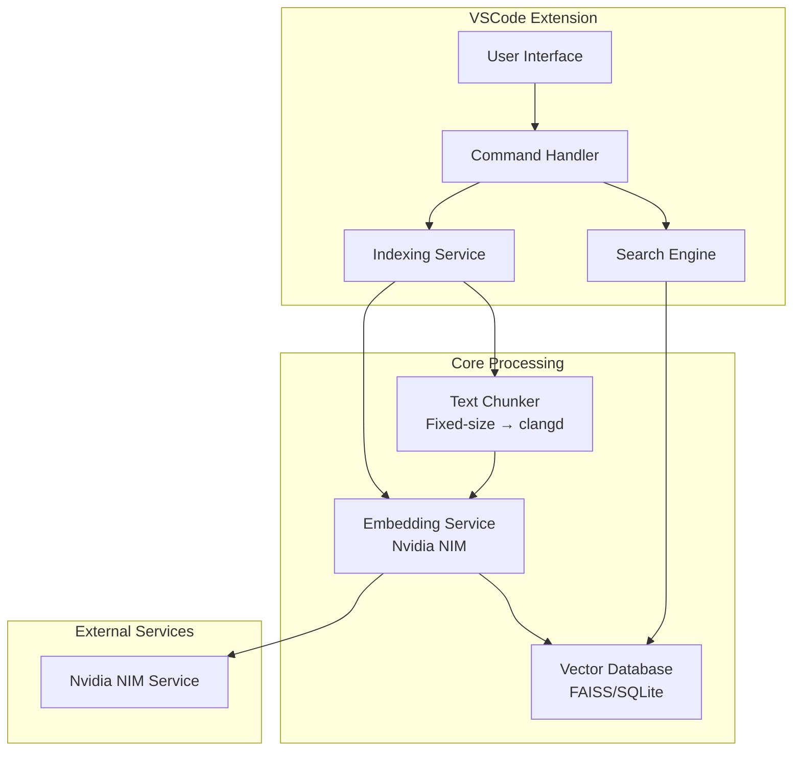
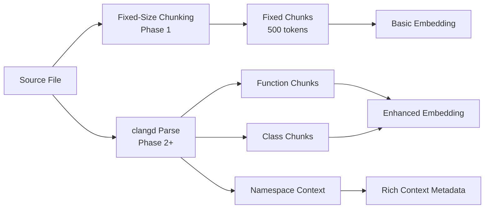
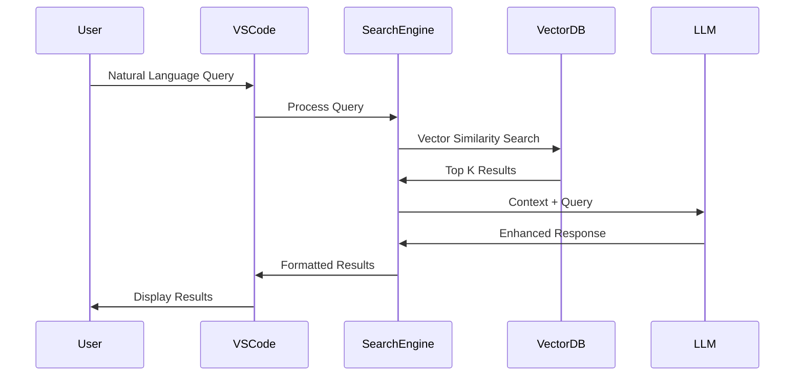

# System Patterns - CppSeek Architecture

## System Architecture Overview

## Core Components

### 1. VSCode Extension Layer
- **Command Handler**: Manages user interactions and commands
- **UI Components**: Search interface, results panel, side panel
- **File Watcher**: Monitors code changes for index updates
- **Configuration**: User preferences and settings

### 2. Code Processing Pipeline
- **Text Chunker**: Fixed-size chunking (Phase 1) → clangd AST parsing (Phase 2)
- **Chunking Strategy**: 500-token chunks with overlap → semantic code segments
- **Context Extraction**: Namespace, class hierarchy, dependencies (Phase 2)
- **Embedding Generation**: Convert code chunks to vector representations

### 3. Search Engine
- **Vector Similarity**: Cosine similarity for semantic matching
- **Ranking Algorithm**: Context-aware result prioritization
- **Query Processing**: Natural language to vector conversion
- **Result Formatting**: Code snippets with metadata

### 4. Data Storage
- **Vector Index**: FAISS for efficient similarity search
- **Metadata Store**: SQLite for file paths, line numbers, context
- **Cache Layer**: Embedding cache for performance optimization

## Key Design Decisions

### Progressive Chunking Strategy

**Decision**: Progressive chunking complexity
- **Phase 1**: Fixed-size text chunking (500 tokens) with overlap
- **Phase 2+**: clangd for semantic AST-aware chunking
- **Benefits**: Simple Phase 1 implementation, semantic accuracy in Phase 2
- **Trade-offs**: Phase 1 may have less precise chunk boundaries

### Embedding Strategy
**Decision**: Use Nvidia llama-3.2-nv-embedqa-1b-v2 via cloud-hosted NIM API
- **Updated Implementation**: Cloud-hosted API instead of local deployment
- **Rationale**: Simplified deployment, no local GPU requirements, reliable service
- **Benefits**: No local resource requirements, managed infrastructure, instant availability
- **Configuration**: Secure .env file API key management with VSCode settings integration
- **Performance**: Validated 361ms response time, 2048-dimensional embeddings
- **Trade-offs**: Requires internet connectivity and API costs (offset by development simplicity)

### Vector Database Selection
**Decision**: FAISS native implementation for high-performance search ✅ **FINAL DECISION**
- **Rationale**: User preference for performance and scalability over simplicity
- **Implementation**: Native FAISS bindings with multiple index types (Flat, IVF, HNSW)
- **Performance Targets**: <5ms search latency for large datasets (50K+ vectors)
- **Benefits**: Sub-linear search complexity O(log n), industry-standard technology
- **Trade-offs**: Environment complexity (GLIBC dependencies) vs performance gains
- **Metadata Storage**: SQLite for chunk metadata and file tracking

### RAG Architecture Pattern

**Decision**: Implement RAG (Retrieval-Augmented Generation) pattern
- **Rationale**: Combines semantic search with LLM understanding
- **Benefits**: Natural language responses, contextual explanations
- **Implementation**: Vector search → context injection → LLM response

## Performance Patterns

### Indexing Strategy
- **Incremental Updates**: Only re-index changed files
- **Background Processing**: Non-blocking index updates
- **Lazy Loading**: Load embeddings on demand
- **Batch Processing**: Group similar operations

### Caching Strategy
- **Embedding Cache**: Store computed embeddings locally
- **Query Cache**: Cache frequent search results
- **File Hash**: Use content hash for cache invalidation
- **Memory Management**: LRU eviction for cache limits

### Error Handling Patterns
- **Graceful Degradation**: Fallback to text search if semantic fails
- **Retry Logic**: Exponential backoff for API calls
- **User Feedback**: Clear error messages and suggestions
- **Logging**: Comprehensive debug information

## Extension Points

### Multi-Language Support
- **Pluggable Parsers**: Tree-sitter for different languages
- **Language-Specific Chunking**: Adapt to language semantics
- **Unified Interface**: Consistent API across languages

### Model Flexibility
- **Embedding Providers**: OpenAI, Nvidia, HuggingFace
- **LLM Integration**: GPT, Gemini, Claude support
- **Local Models**: Support for offline deployment

### Storage Backends
- **Vector Stores**: FAISS, Chroma, Pinecone
- **Metadata Stores**: SQLite, PostgreSQL
- **Cloud Integration**: Remote storage options

## Quality Assurance Patterns

### Testing Strategy
- **Unit Tests**: Core functionality testing
- **Integration Tests**: End-to-end search scenarios
- **Performance Tests**: Large codebase benchmarks
- **User Acceptance Tests**: Real-world usage scenarios

### Monitoring & Telemetry
- **Search Accuracy**: Track result relevance
- **Performance Metrics**: Query response times
- **Usage Analytics**: Feature adoption rates
- **Error Tracking**: Failure analysis and recovery 