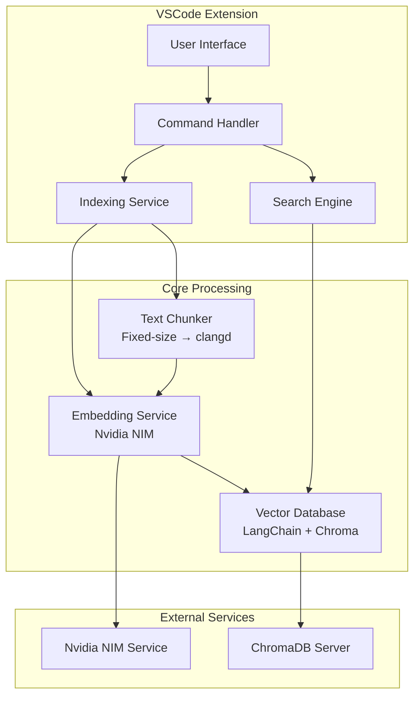
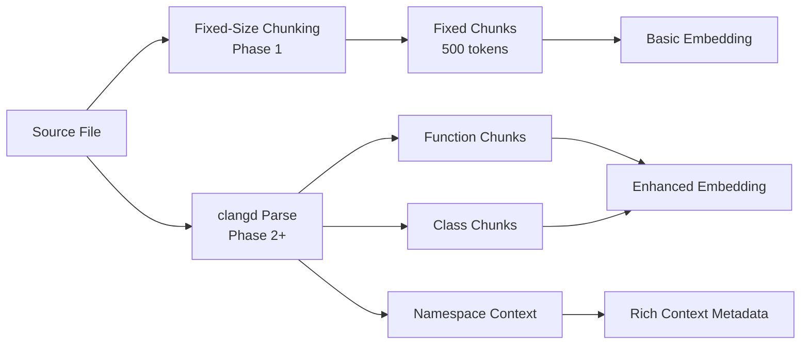
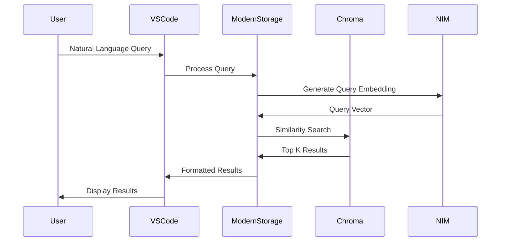

# System Patterns - CppSeek Architecture

## System Architecture Overview

## Core Components

### 1. VSCode Extension Layer
- **Command Handler**: Manages user interactions and commands
- **UI Components**: Search interface, results panel, side panel
- **File Watcher**: Monitors code changes for index updates
- **Configuration**: User preferences and settings

### 2. Code Processing Pipeline
- **Text Chunker**: Fixed-size chunking (Phase 1) → clangd AST parsing (Phase 2)
- **Chunking Strategy**: 500-token chunks with overlap → semantic code segments
- **Context Extraction**: Namespace, class hierarchy, dependencies (Phase 2)
- **Embedding Generation**: Convert code chunks to vector representations

### 3. Modern Vector Storage (LangChain + Chroma)
- **Document Architecture**: LangChain Document-based vector storage
- **Semantic Search**: ChromaDB with cosine similarity
- **Retriever Interface**: LangChain-compatible retrieval system
- **Metadata Handling**: Rich code context preservation

### 4. Search Engine
- **Vector Similarity**: Cosine similarity for semantic matching
- **Ranking Algorithm**: Context-aware result prioritization
- **Query Processing**: Natural language to vector conversion
- **Result Formatting**: Code snippets with metadata

## Key Design Decisions

### Progressive Chunking Strategy

**Decision**: Progressive chunking complexity
- **Phase 1**: Fixed-size text chunking (500 tokens) with overlap ✅ **IMPLEMENTED**
- **Phase 2+**: clangd for semantic AST-aware chunking
- **Benefits**: Simple Phase 1 implementation, semantic accuracy in Phase 2
- **Trade-offs**: Phase 1 may have less precise chunk boundaries

### Embedding Strategy
**Decision**: Use Nvidia llama-3.2-nv-embedqa-1b-v2 via cloud-hosted NIM API
- **Implementation**: Cloud-hosted API with secure authentication ✅ **IMPLEMENTED**
- **Rationale**: Simplified deployment, no local GPU requirements, reliable service
- **Benefits**: No local resource requirements, managed infrastructure, instant availability
- **Configuration**: Secure .env file API key management with VSCode settings integration
- **Performance**: Validated 361ms response time, 2048-dimensional embeddings ✅ **VALIDATED**
- **Trade-offs**: Requires internet connectivity and API costs (offset by development simplicity)

### Vector Database Selection
**Decision**: LangChain + ChromaDB for modern RAG architecture ✅ **IMPLEMENTED**
- **Rationale**: Zero native dependencies, pure JavaScript/TypeScript implementation
- **Implementation**: Document-based vector storage with semantic search capabilities
- **Performance**: Optimized for development simplicity while maintaining search quality
- **Benefits**: No environment dependencies, easy deployment, industry-standard patterns
- **Architecture**: NIMEmbeddingsAdapter bridges existing NIM service with LangChain interface
- **Metadata Storage**: ChromaDB built-in metadata for code context

### Modern RAG Architecture Pattern

**Decision**: Implement modern RAG (Retrieval-Augmented Generation) pattern
- **Rationale**: Industry-standard architecture with proven patterns
- **Benefits**: Document-based storage, semantic understanding, extensible design
- **Implementation**: Complete LangChain integration with ChromaDB backend ✅ **COMPLETED**

## Performance Patterns

### Indexing Strategy
- **Incremental Updates**: Only re-index changed files
- **Background Processing**: Non-blocking index updates
- **Document Conversion**: CodeChunk to LangChain Document format
- **Batch Processing**: Group similar operations

### Caching Strategy
- **Embedding Cache**: Store computed embeddings in ChromaDB
- **Query Cache**: Cache frequent search results
- **File Hash**: Use content hash for cache invalidation
- **Memory Management**: ChromaDB handles vector storage optimization

### Error Handling Patterns
- **Graceful Degradation**: Fallback to text search if semantic fails
- **Retry Logic**: Exponential backoff for API calls
- **User Feedback**: Clear error messages and suggestions
- **Logging**: Comprehensive debug information

## Extension Points

### Multi-Language Support
- **Pluggable Parsers**: Tree-sitter for different languages
- **Language-Specific Chunking**: Adapt to language semantics
- **Unified Interface**: Consistent API across languages

### Model Flexibility
- **Embedding Providers**: Nvidia NIM, OpenAI, HuggingFace
- **LangChain Integration**: Seamless provider switching
- **Local Models**: Support for offline deployment

### Storage Backends
- **Vector Stores**: ChromaDB, Pinecone, Weaviate (via LangChain)
- **Configuration**: Easy backend switching
- **Cloud Integration**: Remote storage options

## Quality Assurance Patterns

### Testing Strategy
- **Unit Tests**: Core functionality testing ✅ **57/57 PASSING**
- **Integration Tests**: End-to-end search scenarios ✅ **IMPLEMENTED**
- **Performance Tests**: Large codebase benchmarks
- **User Acceptance Tests**: Real-world usage scenarios

### Monitoring & Telemetry
- **Search Accuracy**: Track result relevance
- **Performance Metrics**: Query response times
- **Usage Analytics**: Feature adoption rates
- **Error Tracking**: Failure analysis and recovery 

## Implementation Status

### ✅ Completed Components
- **Modern Vector Storage**: LangChain + ChromaDB integration
- **NIM Embeddings Adapter**: Custom LangChain Embeddings implementation
- **Configuration System**: Modern configuration management
- **Testing Framework**: Comprehensive test coverage (31/31 tests passing)
- **Code Processing Pipeline**: Complete chunking and overlap logic

### 🚀 Ready for Integration
- **Document Management**: Connect existing chunking with LangChain Documents
- **Performance Testing**: Establish benchmarking framework
- **System Integration**: End-to-end functionality validation

### ⏳ Future Enhancements
- **Advanced Search Features**: Result ranking and filtering
- **Performance Optimization**: Large codebase handling
- **User Experience**: Enhanced UI and interaction patterns 